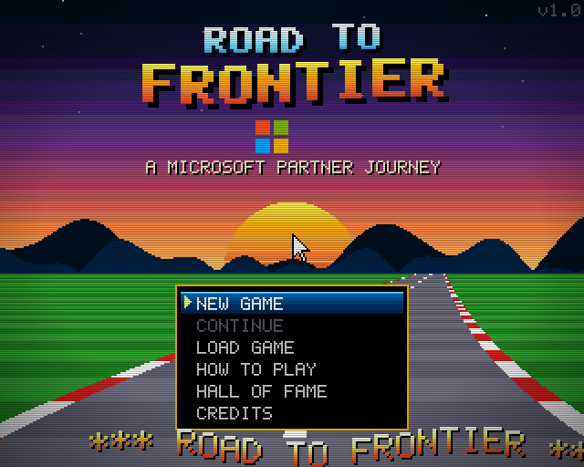
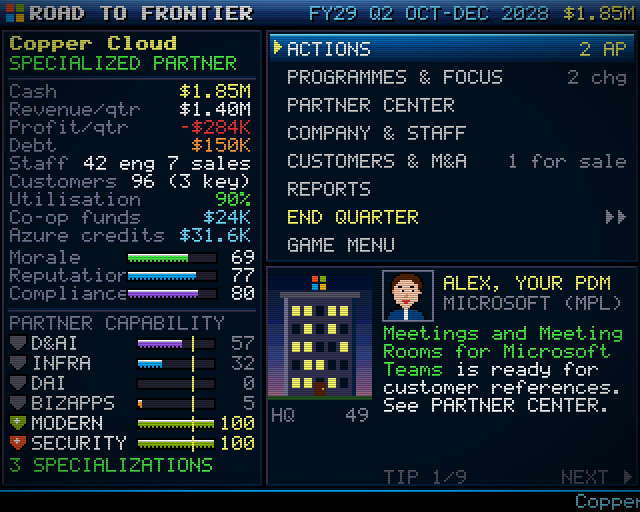
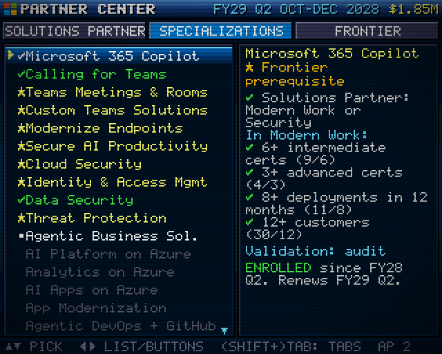

# ROAD TO FRONTIER



An Amiga-style, turn-based strategy game about growing a Microsoft partner through the
**Microsoft AI Cloud Partner Program (MAICPP)**: from **Network member** to **Solutions
Partner**, **Specialized** and finally **Frontier Partner**.

Everything is drawn into a 320×256 PAL "low-res" framebuffer with a 32-colour 12-bit
palette, copper-bar gradients, a hand-made bitmap font, pixel-art icons, a Lotus-style
raster road, a sine scroller and a 4-channel chiptune soundtrack synthesised live with
Web Audio. No game engine and no binary assets.

## Playing

| | |
| --- | --- |
|  |  |

- **Mouse**: click menu items. Right-click or Esc goes back.
- **Keyboard**: arrows/WASD to move, Enter/Space to select, Esc to go back, number keys
  for quick picks. **M** toggles music, **F** toggles fullscreen.
- Progress is autosaved at the start of every quarter. Use **CONTINUE** on the title
  screen, or save to one of three slots from the in-game **GAME MENU**.

### The journey

You start on **1 July 2026**, the first day of Microsoft's **FY27**. Each turn is one
fiscal quarter (Q1 = Jul–Sep). There is **no time limit**: play carries on past FY31,
year after year, until you win or lose. Winning sooner earns a bigger score.

1. **FY planning (every July)**: choose a primary (and optional secondary) focus area,
   a strategic bet for the year, programme budgets (skilling, marketing, sales & co-sell,
   people) and Partner Success Core/Expanded benefits. Partner Success renews when you
   confirm the plan; once you hold a Solutions Partner designation you can switch the
   renewal off, because Solutions Partner benefits exceed it.
2. **Each quarter**:
   - Handle incoming **events** (incidents, opportunities, tricky decisions and their
     delayed consequences).
   - Spend **action points** on: certification bootcamps, Frontier skilling, repeatable
     offers, joining CSP, partner incentives, co-op marketing events, Microsoft Ignite
     (Q2), Microsoft Build (Q4), Partner of the Year nominations (Q3), acquisitions,
     Unified for Partners, co-selling and Partner Center referrals, compliance checks,
     and becoming **customer zero** for Copilot and for Azure (pay in cash, or with the
     Azure credits from your benefits).
   - Make up to two budget tweaks, hire or let staff go, and manage debt.
   - **End the quarter** to see the P&L, customers, deployments, certifications and
     PCS changes.
3. **Year end**: Partner of the Year results, unused Marketing Co-op funds and Azure
   credits expire, and membership renews.

### Who advises you

| Stage | Advice comes from |
| --- | --- |
| Before you join CSP | Automated **MAICPP programme emails** (no-reply) |
| CSP Indirect Reseller | **Sam**, your account manager at your distributor (Indirect Provider) |
| Managed Partner List | **Alex**, your Microsoft Partner Development Manager (PDM) |

Microsoft adds you to the **Managed Partner List** at the start of the FY after you earn
your **second specialization**. CSP Direct Bill partners buy direct from Microsoft, so they
hear from the programme by email until then. Your PDM brings extra co-sell referrals and
champions your Partner of the Year nominations.

### Winning and losing

- **Win**: pass the **Frontier Partner** audit, or win **Partner of the Year**.
- **Lose**: two consecutive quarters with negative cash (bankrupt), or having your
  **MAICPP membership removed** (compliance failures, ignoring verification).

### How the programme is modelled

| Real programme | In the game |
| --- | --- |
| Partner Capability Score (Performance, Skilling, Customer success) | Per area out of 100: net customer adds, intermediate and advanced certs, usage growth and deployments over a rolling 12 months. **70+ with points in every metric** qualifies. |
| Solutions Partner designations (6 areas) | Purchase your first one when qualified; later areas enrol automatically. They renew yearly and only if you still score 70+. |
| Specializations | Unlock only under the designations they align to. They need more certs, deployments and customers, then a third-party audit, a customer reference or automatic enrolment (Business Applications). |
| Frontier Partner specialization | Needs Microsoft 365 Copilot, Data Security, Identity & Access Management, and AI Apps OR AI Platform specializations, plus 5 Frontier Transformation Engineers, 3 DP-600 holders and a passed audit. |
| CSP | Joining as an Indirect Reseller (through an Indirect Provider) adds licence margin, incentives and co-op funds, and makes every new customer count in PCS. Direct Bill needs a designation. |
| Partner benefits & Azure credits | Yearly Azure bulk credits follow the MAICPP Benefits Guide (July 2026): Partner Success Core $2.4K / Expanded $5K; each Solutions Partner designation $4K (Business Applications, Modern Work) or $10K (Azure areas, Security); each specialization $14K (Azure, max 5), $6K (Business Applications or Modern Work, max 3) or $10K (Security, max 3), only with Solutions Partner benefits. Credits are granted on 1 July (or when a benefit is earned) and expire on 30 June. |
| Partner Success vs Solutions Partner | Their internal-use licences overlap rather than stack, so once you hold a designation Partner Success only adds its Azure credits, and you can stop renewing it. |

Specialization alignments follow the prerequisite table on Microsoft Learn. **Thresholds,
prices and payouts are simplified and scaled for gameplay. They are not real programme
numbers.** For the real requirements see:

- <https://aka.ms/specializations>
- <https://learn.microsoft.com/partner-center/membership/partner-capability-score>
- <https://partner.microsoft.com/partnership/partner-benefits-packages-benefits>

## Development

Requires Node.js 20+.

```bash
npm install
npm run dev        # local dev server with hot reload
npm test           # unit tests + bot balance simulation
npm run build      # type-check and production build into dist/
npm run preview    # serve the production build
```

Optional headless smoke tests (need Microsoft Edge or Chrome installed, plus a running
`npm run preview`):

```bash
node scripts/smoke.mjs    # new game -> plan -> events -> hub -> screens -> quarter report
node scripts/smoke2.mjs   # year end, endings, hall of fame, help, credits
node scripts/smoke3.mjs   # plays quarter after quarter through the UI, past FY31, checking for runtime errors
node scripts/smoke4.mjs   # late-game screens (designations, specializations, charts)
node scripts/smoke5.mjs   # advisors, CSP after enrolling, Azure credits & customer zero, Partner Success renewal, FY32
```

Screenshots are written to `screenshots/`.

### Project layout

```
src/
  engine/   gfx (framebuffer), palette, font, sprites (pixel art), input, ui (immediate-mode widgets),
            audio (chiptune synth + songs), fx (copper sky, raster road, scroller, particles)
  game/     data (areas, specializations, offers, benefits, constants), rules (PCS, requirements, Azure
            credits), sim (quarter resolution), events, actions, advisor (who advises you), poty, ops,
            state, save, score, bot (balance-testing AI)
  scenes/   boot, title, setup, plan, event, hub, actions, programmes, partnercenter, company,
            customers, reports, report, yearend, ending, hiscore, help, credits, load, gamemenu
tests/      rules.test.ts (rules, simulation, actions, events, benefits, advisors), balance.test.ts (bot
            simulations), text.test.ts (on-screen text fits its panels)
```

Game logic is pure, deterministic TypeScript driven by a seeded RNG stored in the save, so it is
fully unit-testable without a browser.

## Deploying to GitHub Pages

1. Push this folder to a GitHub repository (default branch `main`).
2. In the repository, go to **Settings → Pages** and set **Source** to **GitHub Actions**.
3. Push to `main`, or run the **Deploy to GitHub Pages** workflow manually. It tests,
   builds and publishes `dist/`.

`vite.config.ts` uses `base: './'`, so the build works under any repository path
(`https://<user>.github.io/<repo>/`).

## Credits & notes

Design, code, pixel art and music by the ROAD TO FRONTIER team, with love for the
Amiga demoscene. The Microsoft four-square logo and colours are redrawn as pixel art.
Customer names are Microsoft's well-known fictitious companies (Contoso, Fabrikam,
Northwind Traders…). This is a fan-made learning game, not an official Microsoft
product.
